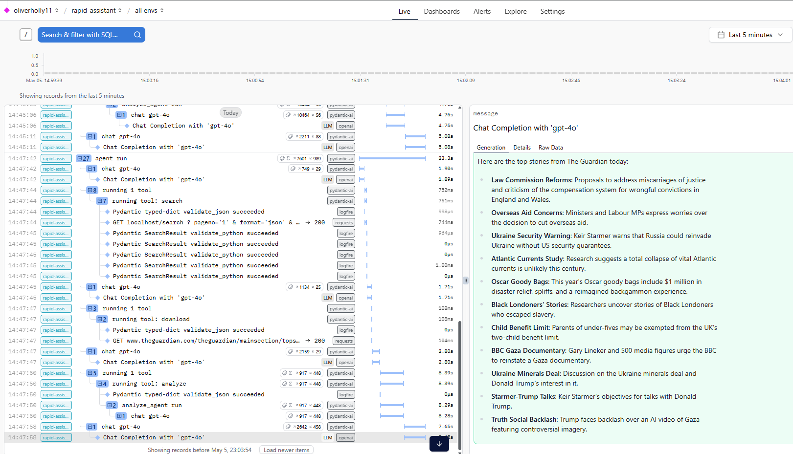

# PydanticAI Internet Search Agent

Simple AI agent that can search the internet for information and summarize it.

- PydanticAI + OpenAI gpt-4o
- SearXNG in docker
- Logfire for debugging

```python
agent.run_sync(
    "Check out the guardians press site for the top stories today, "
    "summarize them into few bullet points."
)
```

